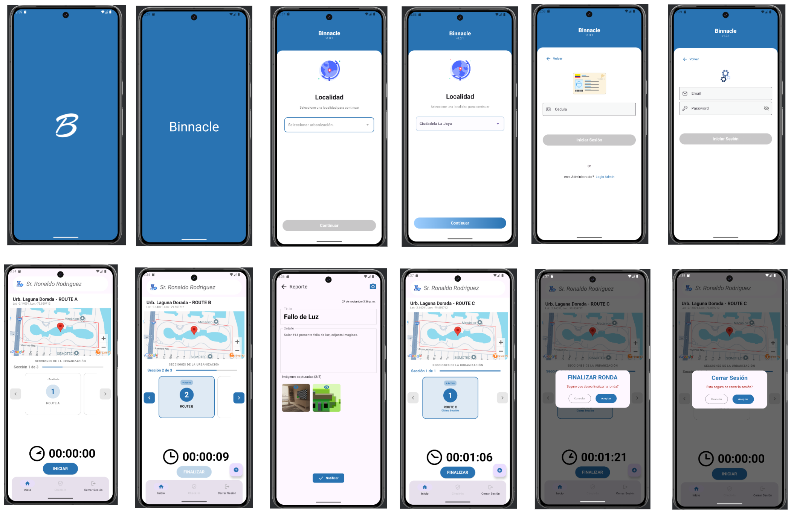

# Binnacle - Security Management System

> 🌐 **Read this in:** [Español](README.es.md)

[](https://kotlinlang.org)
[](https://developer.android.com/jetpack/compose)
[](LICENSE)

**Binnacle** is a modern mobile application built with Jetpack Compose for security management in gated communities. The app enables security guards to conduct rounds, report incidents, and manage attendance while notifying administrators in real-time about important events.

## Overview

Binnacle streamlines security management in residential communities through real-time tracking features, incident reporting, and attendance control. Guards can document events with photographs, conduct GPS-tracked security rounds, and register their check-in/check-out times, while administrators receive instant notifications about any incidents.

## Key Features

### For Security Guards

- **GPS-Tracked Rounds**: Conduct security rounds with real-time visualization of the guard's position on the map during sector patrols
- **Event Reporting**: Report incidents or daily events within the community with photo support
- **Attendance Control**: Automatically register daily check-in and check-out times
- **Intuitive Interface**: Modern Material 3 design optimized for field use

### For Administrators

- **Real-Time Notifications**: Receive immediate alerts when guards report events or incidents
- **Round Monitoring**: Visualize guards' real-time location during their rounds
- **Staff Management**: Access check-in and check-out records of security personnel
- **Event History**: Access complete log of reported incidents

## Screenshots

<p align="center">
  
</p>

The application includes:
- **Splash Screen & Onboarding**: Welcome screen with logo animation and community selection
- **Authentication**: Login for guards (ID number) and administrators (email/password)
- **Main Dashboard**: Intuitive navigation with access to all features
- **GPS Rounds**: Route system with real-time tracking and timer
- **Event Reports**: Report creation with description, photos, and verification
- **Session Management**: Confirmation dialogs for ending rounds and logging out

## Tech Stack

| Category | Technology |
|----------|-----------|
| **Language** | Kotlin |
| **Architecture** | MVVM + StateFlow |
| **UI Framework** | Jetpack Compose + Material 3 |
| **Dependency Injection** | Hilt / Dagger |
| **Navigation** | Navigation Compose |
| **Google APIs** | Maps SDK + Geocoding API |
| **Networking** | Retrofit + OkHttp |
| **Local Database** | Room |
| **Image Loading** | Coil v3 |
| **Background Tasks** | WorkManager |

## Project Structure

The project follows Clean Architecture principles with clear separation of concerns:
```
app/src/main/java/com/clerodri/binnacle/
├── addreport/              # Event reporting module
│   ├── data/              # Repositories, API clients, DTOs
│   ├── domain/            # Use cases, domain models
│   └── presentation/      # ViewModels, Screens, UI components
├── authentication/         # Authentication module
│   ├── data/              # Local and remote data sources
│   ├── domain/            # Authentication business logic
│   └── presentation/      # Login screens (admin/guard)
├── home/                  # Main module
│   ├── data/              # Round management, check-in/out
│   │   └── datasource/
│   │       ├── local/     # Room database
│   │       └── network/   # API services
│   ├── domain/            # Home use cases
│   └── presentation/      # Main screen and components
├── core/                  # Shared components
│   ├── components/        # Reusable UI components
│   └── di/               # Dependency injection modules
├── app/                   # App configuration
│   └── navigation/        # Navigation system
└── ui/theme/             # Material 3 theme and styles
```

### Layer Architecture

Each functional module follows Clean Architecture:

- **Presentation**: ViewModels, Screens (Jetpack Compose), UI Events/States
- **Domain**: Use Cases, Business Models, Repository Interfaces
- **Data**: Repository Implementations, Data Sources (local/remote), DTOs

## Prerequisites

- Android Studio Hedgehog | 2023.1.1 or higher
- JDK 17 or higher
- Android SDK API 24+ (Android 7.0) minimum
- Android SDK API 34 (recommended)
- Google Cloud account with Maps SDK and Geocoding API enabled

## Installation

### 1. Clone the Repository
```bash
git clone https://github.com/your-username/binnacle.git
cd binnacle_kotlin
```

### 2. Configure API Keys

Create or edit the following files in the project root:

#### `local.properties`
```properties
BASE_URL=https://your-backend-url.com/api/
```

#### `secret.properties`
```properties
MAPS_API_KEY=your-google-api-key
```

**Important**: These files are in `.gitignore` and should not be versioned for security reasons.

### 3. Obtain Required API Keys

#### Google Maps API Key
1. Go to [Google Cloud Console](https://console.cloud.google.com/)
2. Create a new project or select an existing one
3. Enable the following APIs:
   - Maps SDK for Android
   - Geocoding API
4. Go to "Credentials" and create an API Key
5. Restrict the key for Android use only (recommended)

#### Backend API Key
Contact the backend administrator to obtain access credentials.

### 4. Sync and Run

1. Open the project in Android Studio
2. Wait for Gradle to sync dependencies
3. Connect an Android device or start an emulator
4. Run the application by pressing Run (▶️) or using `Shift + F10`

## Technical Highlights

### State Management
- StateFlow for reactive data flows
- UiState patterns for predictable UI states
- Single-use events (SingleLiveEvent pattern)

### Data Persistence
- Room for local storage of routes and cache
- DataStore for user preferences
- WorkManager for background synchronization

### Google Maps Integration
- Real-time map visualization
- Guard location tracking during rounds
- Address geocoding

### Image Handling
- Photo capture with CameraX
- Automatic compression and optimization
- Asynchronous upload with WorkManager
- Efficient caching with Coil

## License

This project is licensed under the MIT License. See the [LICENSE](LICENSE) file for details.

---

**Built with ❤️ using Jetpack Compose**